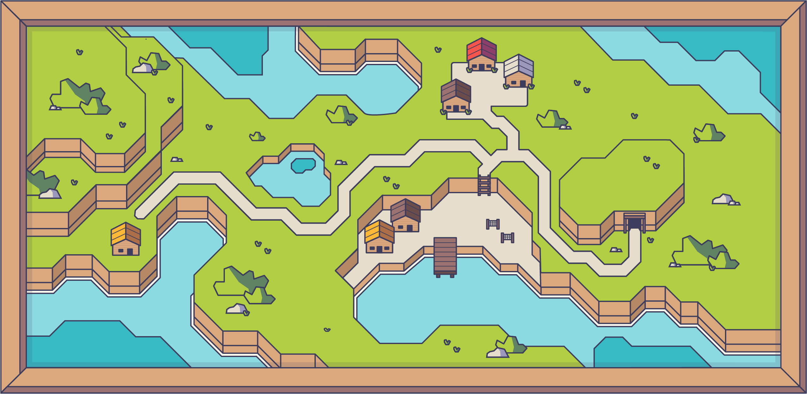

# 2021 Porfolio

This is my 2021 Porfolio: [koalba.com](http://koalba.com/)

## Index

- [Overview](#overview)
  - [Components](#components)
  - [Design](#design)
- [My process](#my-process)
  - [Built with](#built-with)
  - [What I learned](#what-i-learned)
- [Author](#author)
- [Acknowledgments](#acknowledgments)

## Overview

### Components

- Landing:

  - Last Work
  - About Me
  - Blog
  - Contact

- Porfolio:

  - Web
  - Other

- Blog --> Wordpress

### Design

I always loved videogames, they're have been and are a huge part of my life and so, I believe is one of the things that represents me more, so for my 2021 Porfolio I wanted to go for a simple, cute and colorful videogamey UI.

My main reference for this was Brawl Stars UI, taking how they use a bold dark stroke around most of the elements (and even characters) of the game, as well as the light use of shadows to bring volume to them:

I tried diferent color palletes, but in the end I settled for a bright and colorful one, using this type of ilustration as reference:

For my Career Path, I had the idea to make a "Videogame map" where you could see all the levels I've completed (Study, work...) and the level I'm currently on.

## My process

### Built with

- Semantic HTML5 markup
- CSS custom properties
- Flexbox
- [BEM methodology](http://getbem.com/)
- [SASS](https://sass-lang.com/)
- [Jquery](https://jquery.com/)
- Wordpress (Blog)

### What I learned

Firstly, I've challenged myself to make a Wordpress page from scratch, using the Blankslate Theme and editing its style.css. For being the first time, I must admit I'm pretty happy with how it turned out.

I've also learn how to do a parallax effect (Hero Section), how the different items and translates work, etc.

One of my biggest challenges, which I did not undertand why it happened at first and ended up giving me headache its the animations + :hover. When I started with the scroll animations, I realized the hover of the elements stopped working! I had to ask what could have happened, and discovered that, if you use "both" or "forwards", the hover doesn't get the characteristics and, of course, stopped working.

## Author

- Website - [Alba García](https://koalba.com/)
- Github - [Koalba](https://github.com/koalba)
- Linkedin - [Alba García](https://es.linkedin.com/in/koalba)
- ArtStation - [Alba García](https://www.artstation.com/koal_art)

## Acknowledgments

- [Edu Fierro](https://www.youtube.com/c/EduardoFierroPro) - My Master's degree CSS and HTML teacher!
